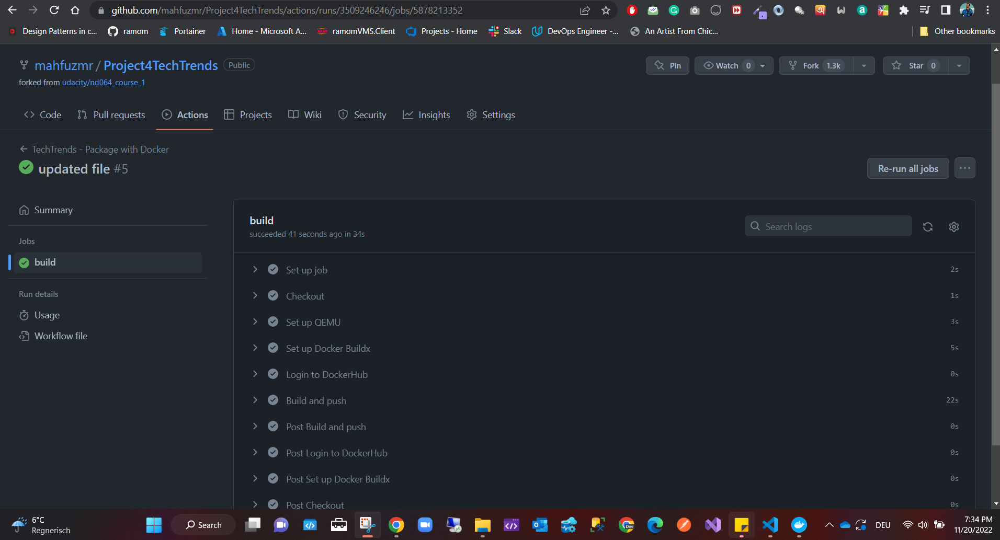
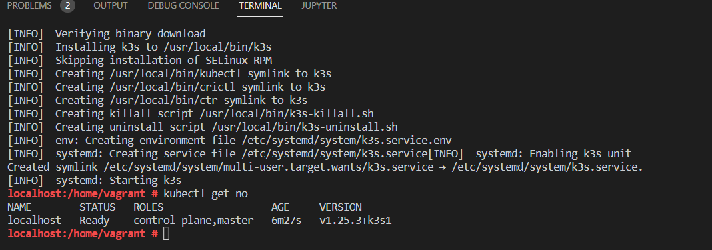
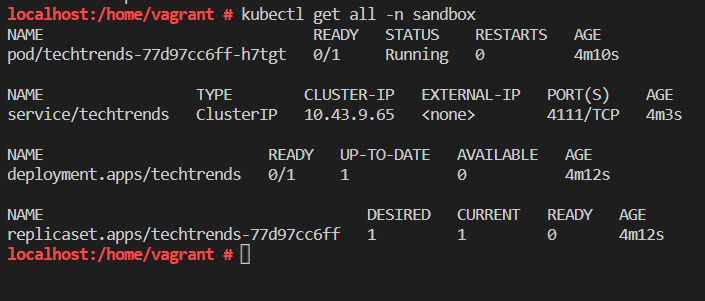
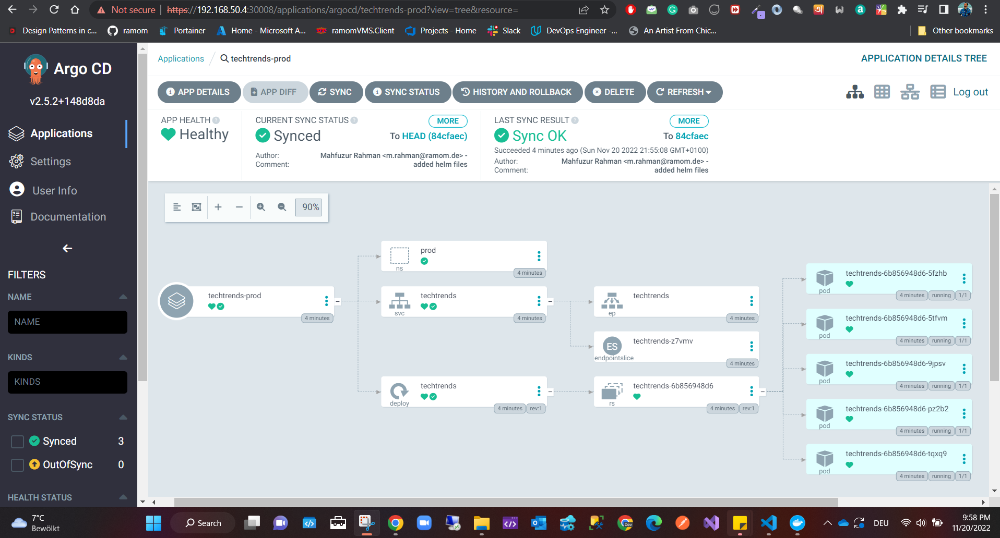
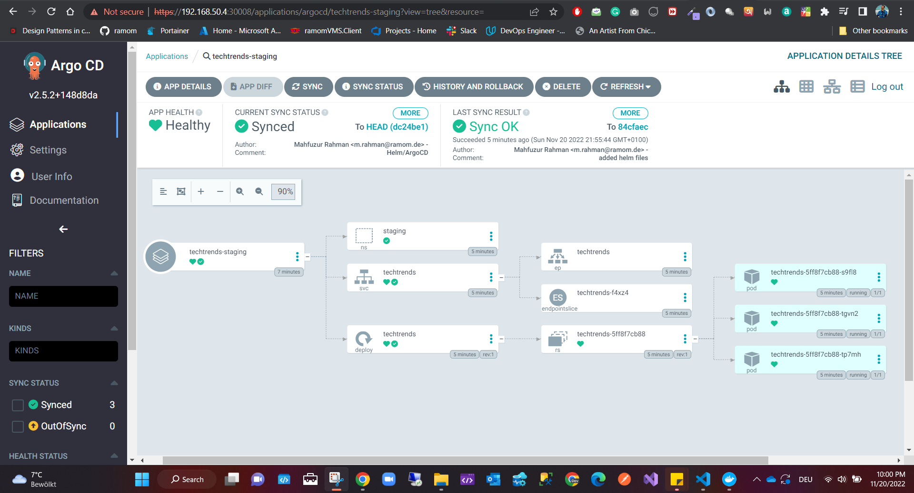

[](https://github.com/mahfuzmr/Project4TechTrends/actions/workflows/techtrends-dockerhub.yml)

# Tech trends DevOps nanodegree
### Cloud Native Fundamentals Scholarship Program Nanodegree Program
## Table of Contents
* [Introduction](#introduction)
* [Docker](#docker)
* [CI GitHub Actions](#ci-github-actions)
* [Deployment on Kubernetes cluster](#deployment-on-kubernetes-cluster)
* [Helm](#helm)
* [Continuous Delivery with ArgoCD](#continuous-delivery-with-argocd)

## Introduction
In this project, we are taking the role of a platform engineer with the main role to package and deploy the application to a Kubernetes platform. Throughout this project, we have used Docker to package the application, and automated the Continuous Integration process with GitHub Actions. For the release process, we have used Kubernetes declarative manifests, which were templated using Helm. To automate the Continuous Delivery process, you have used ArgoCD.

## Docker
Following is the complete walkthrough with a defined screenshot
* Step 1: Repository 
Clone or fork the repository using git command
    ```Bash
        git clone '<REPO LINK>'
    ```
* Step 2: Docker deployment
All the docker commands to deploy the project as a docker image are located in the file path: [Path](https://github.com/mahfuzmr/Project4TechTrends/blob/main/project/techtrends/Dockerfile)

### Command

    1. load the actual working directory
        Command:
        ```Bash
        cd project/techtrends
        ```
    2. Docker login
        Command:
        ```Bash
            docker login
        ```
    3. Docker Build
          ```Bash
            docker build -t techtrends .
        ```
        
    4. Expose the application port
      ```Bash
            docker run -dp 7111:3111 techtrends
        ```
    5. Get the image ID 

        ```Bash
        docker ps
        ```
     5. 
     Docker image creation on dockerhub repository
        ```Bash
        docker tag techtrends mahfuzmr/techtrends:v1.0.0 

        docker push mahfuzmr/techtrends:v1.0.0
        ```    
    
      6.  Get logs by using the image ID

      ```Bash      
      docker logs <image ID>
      ```
      Sample log output

      ```Bash
      # log output
      Running on http://172.17.0.2:3111/ (Press CTRL+C to quit)
      172.17.0.1 - - [20/Nov/2022 16:51:53] "GET / HTTP/1.1" 200 -
      172.17.0.1 - - [20/Nov/2022 16:51:53] "GET /static/css/main.css HTTP/1.1" 200 -
      172.17.0.1 - - [20/Nov/2022 16:51:53] "GET /favicon.ico HTTP/1.1" 404 -
      172.17.0.1 - - [20/Nov/2022 16:54:21] "GET /healthz HTTP/1.1" 200 -
      172.17.0.1 - - [20/Nov/2022 16:54:29] "GET /metrics HTTP/1.1" 200 -
      ```
## CI GitHub Actions

* Step 1: Create a new repo 
* Step 2: push your codes to the new repo 
* Step 3: Add the docker token and GitHub encrypted secrets from the project directory Goto settings > secret > Actions > click New repository secret 
* Step 4: Create the techtrends-dockerhub.yml in the .github/workflows/ Might be created automatically when creating the GitHub action.
* Step 5: Goto GitHub Actions and click on the create a new workflow yourself button
* Step 6: After committing GitHub action will automatically trigger continuous integration


## Deployment on Kubernetes cluster
* Step 1: Using the vagrant file deploy the VM on the virtual box. then ssh to the newly created VM
`vagrant up`
`vagrant ssh`
* Step 2: Install the Kubernetes K3s cluster using make sure to use `sudo su` to execute the bellow command.
`curl -sfL https://get.k3s.io | sh - `
* Step 3: Get all nodes 
`kubectl get no`

* Step 4:  create your Kubernetes Declarative Manifests file namespace.yaml, deploy.yaml and service.yaml

```
touch namespace.yaml
touch deploy.yaml
vim deploy.yaml
touch service.yaml
vim service.yaml
```

```

kubectl apply -f namespace.yaml
kubectl apply -f deploy.yaml
kubectl apply -f service.yaml

```

Get all Kubectl namespace 

`` kubectl get all -n sandbox ``




Gett all running pods 
`` kubectl get po -A `

## Helm
Helm is the best way to find, share, and use software built for Kubernetes.

* Step 1: Create the folder templates/ and add all required files.
* Step 2: Create the chart.yaml, values.yaml 

## Continuous Delivery with ArgoCD
Argo CD is a declarative, GitOps continuous delivery tool for Kubernetes.

* Step 1: Bellow command will install ArgoCD in our VM

```
kubectl create namespace argocd
kubectl apply -n argocd -f https://raw.githubusercontent.com/argoproj/argo-cd/stable/manifests/install.yaml
```

### Get all pods to ensure argocd is up and running

`` kubectl get po -n argocd ``

### Get all services

`` kubectl get svc -n argocd ``

* Step 2: Now we need to expose it to the internet
First, we need to get the argocd-server from the list of services and copy the yaml 

` argocd-server-nodeport.yaml` 

from the file location https://github.com/udacity/nd064_course_1/blob/main/solutions/argocd/argocd-server-nodeport.yaml 

  `touch argocd-server-nodeport.yaml
  kubectl apply -f argocd-server-nodeport.yaml`
  
  See all the ArgoCD server is running
     ``` kubectl get svc -n argocd ```
  

* Step 3: Access the ArgoCD UI by going to https://192.168.50.4:30008 or http://192.168.50.4:30007
To login to argocd 
username: admin
password: run command `` kubectl -n argocd get secret argocd-initial-admin-secret -o jsonpath="{.data.password}" | base64 -d; echo ``
generated password: <Our password we get from the <<<<<<aprevious command>

kubectl describe po -n sandbox


``touch helm-techtrends-staging.yaml``
``touch helm-techtrends-prod.yaml``

Update the files with code from the given file in the repo on location [Path](https://github.com/mahfuzmr/Project4TechTrends/tree/main/project/argocd)

* Step 4: Apply the configuration and deploy the production and staging to the ArgoCD server

``kubectl apply -f helm-techtrends-staging.yaml``
``kubectl apply -f helm-techtrends-prod.yaml``

After Sync the deployment is up and running




